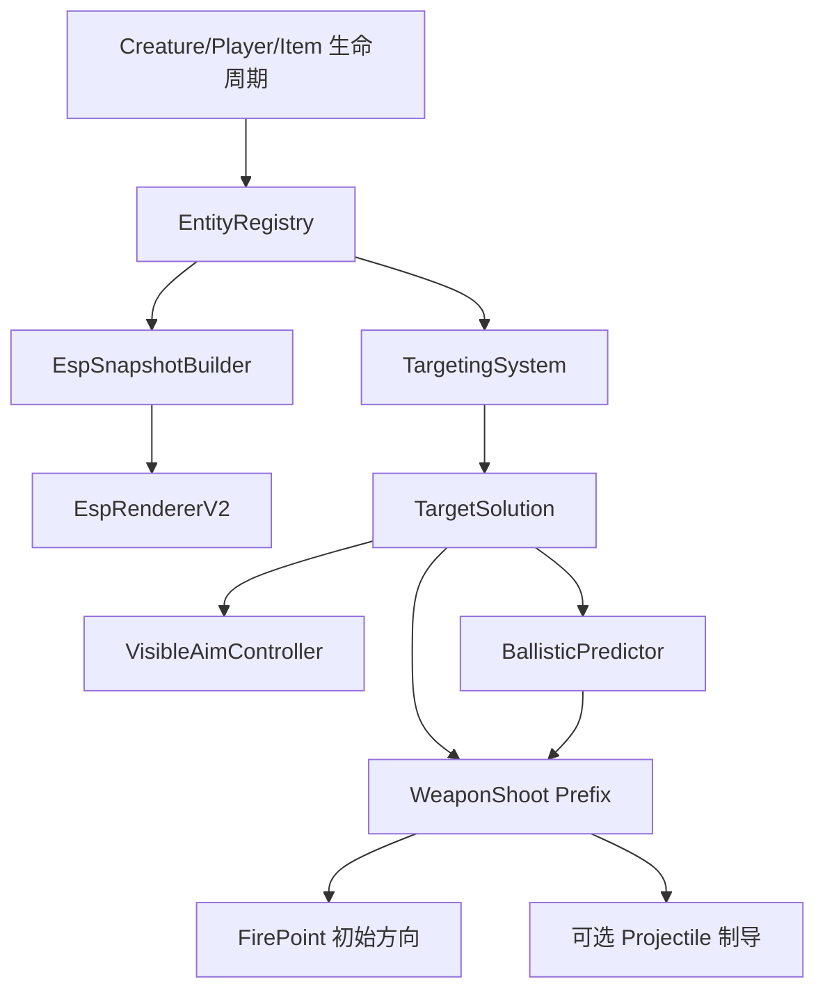

# CompleteCheatMenu cnKX 功能移植实施计划

> **For Claude:** REQUIRED SUB-SKILL: Use superpowers:executing-plans to implement this plan task-by-task.

**Goal:** 在 Windows Unity/BepInEx 架构中重建 cnKX 的 ESP、自瞄、射击方向追踪、移动预判、瞬击及相关过滤/显示能力，同时保留 CompleteCheatMenu 现有功能、中文界面、性能优化和可回滚部署。

**Architecture:** 不复制 cnKX 的 Android ARM64、UE4 地址 Hook、EGL SurfaceView 或原生 ImGui 后端；将其行为拆成实体注册、快照、目标解算、弹道预测和绘制五层，并使用 Unity API、BepInEx 与 Harmony 实现。ESP、自瞄和射击共享只读实体注册表，但分别维护快照、刷新节奏和状态，消除当前 `VisualCheats._targets/_nextScan` 的互相覆盖。

**Tech Stack:** C# 12、.NET Standard 2.1、BepInEx 5.4.23.5、Harmony、Unity 6、Unity IMGUI/GUI、Unity Physics、PowerShell、Python 确定性测试。

---

## 1. 范围与完成定义

### 1.1 纳入范围

- 模型包围框、射线、骨骼、血条、名称、真实距离、目标类型、手持物、价值、数量统计。
- 可见/遮挡配色、当前锁定目标高亮、屏幕圆形锁定范围。
- 生物、玩家、物品、掉落容器的独立注册与快照。
- 头部优先、胸部优先、指哪打哪、固定高度、自动可见部位。
- 静默枪口修正、开火拉枪、发射瞬间方向追踪。
- 追踪概率、目标速度估计、二次飞行时间预测、可选重力补偿。
- 高速子弹/瞬击的原值保存和恢复。
- 中文 UI、配置预设、诊断信息、构建、部署和回滚。

### 1.2 行为定义

cnKX 的“子弹追踪”在 `trace()` 中改写 `ShootRot/BulletRot`，属于**发射瞬间方向重定向**。本计划先实现该行为的 Unity 等价版本。投射物生成后持续转向的“连续制导”作为条件功能，仅在确认稳定的 Projectile 更新入口后启用，不作为首个发布门槛。

### 1.3 不复制的 cnKX 缺陷

- 不复用同一评分变量处理骨骼评分和实体评分。
- 不使用方形条件判定圆形锁定范围。
- 不保留一帧延迟的 `LockObj/TargetLoc` 更新。
- 不混用厘米距离与米制弹速。
- 不使用产生 101 个整数结果的概率判定。
- 不在每个骨骼线段上重复执行多次射线检测。
- 不连续覆盖六个相邻 float 且不保存原值。
- 不在绘制循环中执行武器字段写入。

### 1.4 完成标准

1. 开启玩家自瞄时，生物、玩家、物品和容器 ESP 不互相消失。
2. ESP 只在 `EventType.Repaint` 执行投影和绘制。
3. 显示锁定圆与实际圆形判定使用同一像素半径。
4. 0% 追踪从不触发，100% 追踪始终触发。
5. 静止目标预测点等于当前目标点；横向目标预测方向正确。
6. 关闭瞬击或切换武器后恢复该武器原始弹速。
7. 热路径测试无持续托管分配，目标选择语义测试全部通过。
8. BepInEx 加载插件、Harmony 补丁成功，日志无插件异常。
9. 回滚脚本在测试副本上恢复基线 SHA-256。

---

## 2. 目标架构



### 2.1 所有权边界

| 组件 | 负责 | 不负责 |
|---|---|---|
| `EntityRegistry` | 注册、去重、清理、静态元数据 | 绘制、评分、字段写入 |
| `EspSnapshotBuilder` | ESP 过滤和只读快照 | 自瞄锁定状态 |
| `TargetingSystem` | 过滤、骨骼选择、评分、锁定 | GUI 绘制、武器属性修改 |
| `BallisticPredictor` | 速度估计与预测点 | 目标获取、概率 |
| `EspRendererV2` | 投影与绘制 | 场景全量扫描 |
| `ShotRedirector` | 概率与发射方向 | 实体注册、持续扫描 |
| `WeaponStateStore` | 保存与恢复武器原值 | 目标选择 |

---

## 3. 实施任务

### Task 1：保存基线与生成绑定清单 ✅ 已完成（2026-08-25）

**完成记录：**

- `BINDING_INVENTORY=PASS`，必需缺失 `0`，可选未解析 `0`。
- 已确认部署版本 `0.7.0+optimized-aim`，部署 DLL SHA-256 为 `F4B5209647A60C0BE7E5C49005867A4CE094FEB56C03AD804AEC67C35FE3BA79`。
- 已保存原始 `GameBinder.cs`，新增精确候选成员解析辅助方法，基线与修改版均构建成功。
- 已在独立测试副本执行回滚，恢复 SHA-256 与原始源码一致。
- 验证记录：`artifacts/cnkx-port/VERIFICATION_TASK1.txt`。
- 当前目录没有 Git 元数据，提交步骤记录为 `SKIPPED_NOT_A_GIT_REPOSITORY`；文件变更、diff、构建和回滚证据均已落盘。

**Files:**
- Create: `artifacts/cnkx-port/baseline.json`
- Create: `artifacts/cnkx-port/binding-inventory.txt`
- Create: `tools/inspect_game_bindings.ps1`
- Modify: `decompiled-src/CompleteCheatMenu/Game/GameBinder.cs`
- Test: `artifacts/cnkx-port/binding-inventory.txt`

**Steps:**

1. 计算当前源码 DLL、优化汉化 DLL和游戏目录部署 DLL 的 SHA-256。
2. 记录程序集版本、产品版本、文件长度和修改时间。
3. 使用反射/元数据检查下列类型与成员：`Creature`、`Fish`、`Player`、`Weapon`、`Projectile`、`Item`、`ItemManager`、生命组件、Animator、Renderer、Collider。
4. 将候选字段分为 `resolved`、`optional`、`missing`，禁止靠字段名猜测直接写入。
5. 执行：

```powershell
& .\tools\inspect_game_bindings.ps1
```

Expected:

```text
BINDING_INVENTORY=PASS
DEPLOYED_VERSION=0.7.0+optimized-aim
```

6. 提交：`chore: capture cnkx port baseline and bindings`。

### Task 2：先建立纯数学测试基线 ✅ 已完成（2026-08-25）

**完成记录：**

- 保留既有 `aim_scoring_test.py`，SHA-256 为 `CB84D5A26B79D4D4B8B14C611F37A5C1ED25AD93FFB1F668C7BF0041F23A16F0`。
- 已新增圆形范围、实体/骨骼评分、弹道预测和概率边界契约测试。
- 三个新测试均通过 Python 语法编译，并按 TDD 预期以 `missing implementation` 失败；既有 9 项评分测试继续通过。
- 已在两个独立测试目录验证 PowerShell/Bash 回滚，均移除 3 个新增测试且无残留。
- 验证记录：`artifacts/cnkx-port/VERIFICATION_TASK2.txt`。
- 当前目录没有 Git 元数据，提交步骤记录为 `SKIPPED_NOT_A_GIT_REPOSITORY`。

**Files:**
- Create: `tests/targeting_math_test.py`
- Create: `tests/ballistic_prediction_test.py`
- Create: `tests/tracking_probability_test.py`
- Preserve: `tests/aim_scoring_test.py`

**Steps:**

1. 添加圆形屏幕半径测试：边界内、边界上、方形角落但圆外。
2. 添加距离/角度/切换惩罚测试。
3. 添加独立骨骼评分和实体评分测试。
4. 添加静止、横移、接近、远离、零弹速和异常速度测试。
5. 添加 0% 与 100% 的确定性概率边界测试。
6. 执行：

```powershell
python .\tests\aim_scoring_test.py
python .\tests\targeting_math_test.py
python .\tests\ballistic_prediction_test.py
python .\tests\tracking_probability_test.py
```

Expected before implementation:

```text
AIM_SCORING_TESTS=PASS cases=9
TARGETING_MATH_TESTS=FAIL missing implementation
BALLISTIC_PREDICTION_TESTS=FAIL missing implementation
TRACKING_PROBABILITY_TESTS=FAIL missing implementation
```

7. 提交：`test: define cnkx targeting and prediction behavior`。

### Task 3：创建独立实体注册表 ✅ 已完成（2026-08-25）

**完成记录：**

- 已建立生物、玩家、物品、容器四个独立集合以及玩家/物品/容器三个独立刷新时间门。
- 生物和玩家分别通过 `Creature.Awake`、`Player.Awake` 增量注册；记录缓存名称、类型、Transform、稳定运行时 ID 和扫描代次。
- 注册保持幂等，销毁与过期记录使用倒序循环清理；管理器集合暂时不可用时只清理已销毁对象，不清空有效缓存。
- `AimTargetRegistry` 已改成读取 `EntityRegistry.Creatures` 的兼容适配器，现有 `WeaponCheats` 接口保持可用。
- `ENTITY_REGISTRY_TESTS=PASS cases=9`，既有 `AIM_SCORING_TESTS=PASS cases=9`，修改版程序集构建成功。
- 已在两个独立目录验证 PowerShell/Bash 回滚，原文件哈希恢复且 4 个新增文件无残留。
- 验证记录：`artifacts/cnkx-port/VERIFICATION_TASK3.txt`。
- 当前目录没有 Git 元数据，提交步骤记录为 `SKIPPED_NOT_A_GIT_REPOSITORY`。

**Files:**
- Create: `decompiled-src/CompleteCheatMenu/Runtime/EntityRegistry.cs`
- Create: `decompiled-src/CompleteCheatMenu/Runtime/EntityRecord.cs`
- Modify: `decompiled-src/CompleteCheatMenu/Patches/CreatureRegistry_Patch.cs`
- Create: `decompiled-src/CompleteCheatMenu/Patches/PlayerRegistry_Patch.cs`
- Modify: `decompiled-src/CompleteCheatMenu/Cheats/AimTargetRegistry.cs`
- Test: `tests/entity_registry_test.py`

**Steps:**

1. 为生物、玩家、物品和容器建立独立集合与独立刷新时间。
2. 生物继续通过 `Creature.Awake` 增量注册。
3. 注册时缓存名称、类型、Transform 和稳定实例标识。
4. 使用倒序循环清理 Unity 已销毁对象。
5. 注册操作保持幂等；禁止 LINQ 和每帧列表复制。
6. 使 `AimTargetRegistry` 暂时成为新注册表的兼容适配器。
7. 执行注册、去重、清理和独立刷新测试。
8. 提交：`refactor: separate entity registries from visual targets`。

### Task 4：拆分 ESP 与自瞄快照 ✅ 已完成（2026-08-25）

**完成记录：**

- 已新增 `EspSnapshot`、`EspSnapshotBuilder` 和 `TargetingSnapshot`，ESP 与自瞄分别维护独立只读视图。
- `WeaponCheats` 已移除对 `VisualCheats.Rescan(...players...)` 和 `VisualCheats.Targets` 的依赖，玩家与生物自瞄直接读取 `TargetingSnapshot`。
- `VisualCheats.Targets` 兼容入口继续保留，但其内容只由 ESP 快照修订号更新，不再执行场景扫描。
- ESP 四类列表分别来自 `EntityRegistry.Creatures/Players/Items/Containers`；自瞄刷新不会清空或重建 ESP 快照。
- `SNAPSHOT_ISOLATION_TESTS=PASS cases=7`，实体注册与既有自瞄评分回归测试继续通过，修改版构建成功。
- 已在两个独立目录验证 PowerShell/Bash 回滚，3 个既有文件恢复原始哈希，4 个新增文件无残留。
- 验证记录：`artifacts/cnkx-port/VERIFICATION_TASK4.txt`。
- 当前目录没有 Git 元数据，提交步骤记录为 `SKIPPED_NOT_A_GIT_REPOSITORY`。

**Files:**
- Create: `decompiled-src/CompleteCheatMenu/Runtime/EspSnapshot.cs`
- Create: `decompiled-src/CompleteCheatMenu/Runtime/EspSnapshotBuilder.cs`
- Create: `decompiled-src/CompleteCheatMenu/Targeting/TargetingSnapshot.cs`
- Modify: `decompiled-src/CompleteCheatMenu/Cheats/VisualCheats.cs`
- Modify: `decompiled-src/CompleteCheatMenu/Runtime/TickDriver.cs`
- Modify: `decompiled-src/CompleteCheatMenu/Cheats/WeaponCheats.cs`

**Steps:**

1. 删除自瞄对 `VisualCheats.Targets` 的读取依赖。
2. ESP 快照只读取 `EntityRegistry`，不更新自瞄锁定状态。
3. 自瞄快照只读取 `EntityRegistry`，不清空 ESP 列表。
4. 保留旧 `VisualCheats.Targets` 兼容入口直至 EspRendererV2 完成。
5. 添加回归测试：玩家自瞄刷新后，ESP 四类数量保持不变。
6. 提交：`fix: prevent player aim scans from replacing esp targets`。

### Task 5：实现统一目标数据与评分器 ✅ 已完成（2026-08-25）

**完成记录：**

- 已新增 `TargetCandidate` 与 `TargetSolution`，统一保存实体、Transform、瞄准点、骨骼、距离、角度、屏幕位置/距离、可见性、速度、评分和时间戳。
- 已新增 `TargetingSettings.FromCheatState()`，集中读取距离、角度、屏幕半径、三项评分权重、切换惩罚、优先奖励上限与视线要求。
- `TargetScorer` 使用 `delta.sqrMagnitude <= radius * radius` 实现真正的圆形屏幕范围，并使用确定性的距离/角度/屏幕距离/切换惩罚评分。
- 信天翁优先改为显式奖励，使用 `Mathf.Clamp` 限制到配置上限，不再完全忽略距离；`BoneScore` 与 `EntityScore` 分别保存。
- `TARGETING_MATH_TESTS=PASS cases=10`；快照隔离、实体注册和既有自瞄评分回归测试继续通过，修改版程序集构建成功。
- 弹道预测与追踪概率测试保持预期红灯，分别留给 Task 8 与 Task 9。
- 已在两个独立目录验证 PowerShell/Bash 回滚，2 个既有文件恢复原始哈希，5 个新增文件无残留。
- 验证记录：`artifacts/cnkx-port/VERIFICATION_TASK5.txt`。
- 当前目录没有 Git 元数据，提交步骤记录为 `SKIPPED_NOT_A_GIT_REPOSITORY`。

**Files:**
- Create: `decompiled-src/CompleteCheatMenu/Targeting/TargetSolution.cs`
- Create: `decompiled-src/CompleteCheatMenu/Targeting/TargetCandidate.cs`
- Create: `decompiled-src/CompleteCheatMenu/Targeting/TargetScorer.cs`
- Create: `decompiled-src/CompleteCheatMenu/Targeting/TargetingSettings.cs`
- Modify: `decompiled-src/CompleteCheatMenu/Runtime/CheatState.cs`

**Steps:**

1. 定义目标实体、目标点、骨骼、距离、角度、屏幕距离、可见性、速度和评分字段。
2. 实现圆形屏幕范围：`dx*dx + dy*dy <= radius*radius`。
3. 实现普通评分：距离权重、角度权重、屏幕距离权重和切换惩罚。
4. 将“信天翁优先”改为显式优先级奖励，并设置可配置上限，避免完全忽略距离。
5. 骨骼评分与实体评分分别保存。
6. 运行 Task 2 的数学测试，Expected：`TARGETING_MATH_TESTS=PASS`。
7. 提交：`feat: add deterministic target scorer`。

### Task 6：实现骨骼与瞄准点解析 ✅ 已完成（2026-08-25）

**完成记录：**

- 已新增 `AimPoint`、`BoneResolver` 与 `RendererBoundsResolver`，统一输出可投影的头部、胸部、骨盆、包围盒上部、身体中心和固定高度瞄准点。
- 玩家优先通过 `Animator.GetBoneTransform(HumanBodyBones.Head/Chest/Hips)` 获取标准 humanoid 骨骼。
- 生物按“命名层级骨骼 → `SkinnedMeshRenderer.bones` → Renderer Bounds”顺序解析，缺失任一层级时继续回退且不抛异常。
- “指哪打哪”过滤相机后方点及 NaN/Infinity 投影，只从有效点中选择距离屏幕中心最近者。
- Renderer Bounds 会合并目标全部子 Renderer，并生成包围盒上部与中心点；最后保留根节点固定高度点作为终极回退。
- `BONE_SELECTION_TESTS=PASS cases=7`，Task 3–5 回归测试继续通过，修改版程序集构建成功并包含三个新增类型。
- 已在两个独立目录验证 PowerShell/Bash 回滚，`build.ps1` 恢复原始哈希，5 个新增文件无残留。
- 验证记录：`artifacts/cnkx-port/VERIFICATION_TASK6.txt`。
- 当前目录没有 Git 元数据，提交步骤记录为 `SKIPPED_NOT_A_GIT_REPOSITORY`。

**Files:**
- Create: `decompiled-src/CompleteCheatMenu/Targeting/AimPoint.cs`
- Create: `decompiled-src/CompleteCheatMenu/Targeting/BoneResolver.cs`
- Create: `decompiled-src/CompleteCheatMenu/Targeting/RendererBoundsResolver.cs`
- Test: `tests/bone_selection_test.py`

**Steps:**

1. 玩家优先读取 `Animator.GetBoneTransform(HumanBodyBones.*)`。
2. 生物依次尝试已知骨骼名、SkinnedMeshRenderer bones、Renderer Bounds。
3. 提供头部、胸部、骨盆、身体中心和固定高度点。
4. “指哪打哪”只在屏幕前方且可投影的点中选择最近点。
5. 目标缺少骨骼时回退到包围盒上部/中心，不抛异常。
6. 运行骨骼选择测试。
7. 提交：`feat: resolve target bones and fallback aim points`。

### Task 7：实现可见性缓存和 TargetingSystem ✅ 已完成（2026-08-25）

**完成记录：**

- 已新增 `VisibilityCache`，使用“实体实例 ID + 瞄准点名称/来源”作为短周期缓存键；同一刷新周期不重复对同一点发射射线。
- 射线未命中视为可见；命中目标本体、目标子对象或目标父对象也视为可见，其他遮挡物视为不可见。
- 已新增集中式 `TargetingSystem.Acquire(Camera)`，在同一次调用内刷新目标快照、解析骨骼、选择瞄准点、判断可见性、评分并生成 `TargetSolution`。
- 每个实体只对最终选中的最近屏幕瞄准点执行至多一次所需射线，不再按每段骨骼重复检测。
- 目标保持期内仅在当前目标仍有效时保持；目标销毁、失活、被过滤、不可见或超出范围时立即释放。保持期结束后使用统一评分和切换惩罚选择新目标。
- `WeaponCheats.CurrentTarget` 已改为 `TargetSolution` 兼容视图，旧 `FindTarget/EvaluateCandidate/HasLineOfSight` 分散逻辑已移除；开火瞄准直接使用同次解算得到的 `AimPoint`。
- 武器页目标状态同步改为显示 `TargetSolution` 的实体名称、距离、角度和骨骼名称。
- `TARGET_LOCK_TESTS=PASS cases=8`；Task 3–6 回归测试继续通过，修改版程序集构建成功。
- 已在两个独立目录验证 PowerShell/Bash 回滚，3 个既有文件恢复原始哈希，4 个新增文件无残留。
- 验证记录：`artifacts/cnkx-port/VERIFICATION_TASK7.txt`。
- 当前目录没有 Git 元数据，提交步骤记录为 `SKIPPED_NOT_A_GIT_REPOSITORY`。

**Files:**
- Create: `decompiled-src/CompleteCheatMenu/Targeting/VisibilityCache.cs`
- Create: `decompiled-src/CompleteCheatMenu/Targeting/TargetingSystem.cs`
- Modify: `decompiled-src/CompleteCheatMenu/Cheats/WeaponCheats.cs`
- Test: `tests/target_lock_test.py`

**Steps:**

1. 按对象和目标点缓存短周期可见性结果。
2. 射线命中目标、目标子对象或目标父对象时视为可见。
3. 每个候选目标每个刷新周期最多执行所需的少量射线，不按骨骼线段重复检测。
4. 在同一次 `Acquire()` 中确定目标和目标点，消除前一帧目标引用。
5. 实现保持时间、目标失效立即释放和切换惩罚。
6. `WeaponCheats.CurrentTarget` 改为读取 `TargetSolution` 兼容视图。
7. 运行目标锁定测试。
8. 提交：`feat: centralize target acquisition and visibility`。

### Task 8：实现移动速度估计与弹道预测 ✅ 已完成（2026-08-25）

**完成记录：**

- 已新增 `VelocityTracker`，按实体实例 ID 保存最多 4 个带 Unity 秒制时间戳的位置样本，使用固定容量环形数组避免无限增长。
- 采样间隔小于配置阈值时复用现有估计；单次位移超过传送阈值或速度超过上限时立即重置轨迹并返回零速度。
- 已新增 `BallisticPredictor`，统一使用 Unity 世界单位/秒，弹速无效、速度非有限或预测结果异常时返回当前目标点。
- 飞行时间使用两次距离迭代，支持接近、远离和横向移动目标；可选重力补偿默认关闭，并提供重力比例设置。
- `TargetingSystem` 已接入 `VelocityTracker`，每个有效候选的估算速度写入 `TargetCandidate.Velocity`，随后进入 `TargetSolution.Velocity`。
- `CheatState` 已新增预测开关、最小采样间隔、传送距离、最大目标速度、重力补偿开关与重力比例；UI 留到 Task 13 集中加入。
- `BALLISTIC_PREDICTION_TESTS=PASS cases=7`；Task 3–7 回归测试继续通过，修改版程序集构建成功并包含两个新增类型。
- 追踪概率测试保持预期红灯，留给 Task 9。
- 已在两个独立目录验证 PowerShell/Bash 回滚，4 个既有文件恢复原始哈希，2 个新增文件无残留。
- 验证记录：`artifacts/cnkx-port/VERIFICATION_TASK8.txt`。
- 当前目录没有 Git 元数据，提交步骤记录为 `SKIPPED_NOT_A_GIT_REPOSITORY`。

**Files:**
- Create: `decompiled-src/CompleteCheatMenu/Targeting/VelocityTracker.cs`
- Create: `decompiled-src/CompleteCheatMenu/Targeting/BallisticPredictor.cs`
- Modify: `decompiled-src/CompleteCheatMenu/Runtime/CheatState.cs`
- Test: `tests/ballistic_prediction_test.py`

**Steps:**

1. 为每个目标保存有限个时间戳位置样本。
2. 过滤时间间隔过小、传送跳变和异常速度。
3. 统一使用 Unity 世界单位与秒。
4. 实现二次飞行时间迭代。
5. 弹速无效时返回当前目标点。
6. 可选加入重力补偿，默认关闭。
7. 运行预测测试，Expected：`BALLISTIC_PREDICTION_TESTS=PASS`。
8. 提交：`feat: add unit-consistent ballistic prediction`。

### Task 9：实现发射瞬间方向追踪 ✅ 已完成（2026-08-25）

**完成记录：**

- 已新增 `ShotRedirector`，在 Harmony `Weapon.Shoot` 前缀执行期间即时调用 `TargetingSystem.Acquire(camera)`，不依赖 UI 预览目标缓存。
- `AimBeforeShot()` 已拆分为 `AlignFirePointToView()` 视线对齐分支与 `ShotRedirector.TryRedirect()` 目标追踪分支；两者可独立启用，追踪成功时覆盖视线方向。
- 追踪概率使用 `Random.value` 与 `sample < probability`，百分比先钳制到 0–100%；0% 始终关闭，100% 对 `[0,1)` 样本始终开启。
- 启用预判时使用 `BallisticPredictor.Predict()`，并传入当前解算速度、实际/配置弹速及可选重力补偿。
- 追踪成功后仅修改 `FirePoint.rotation`，Harmony 前缀返回后继续执行原始 `Weapon.Shoot()`。
- 已加入默认关闭的诊断日志开关，日志最短间隔 2 秒，不逐发刷屏。
- `CheatState` 已新增追踪概率与诊断开关；UI 留到 Task 13 集中加入。
- `TRACKING_PROBABILITY_TESTS=PASS cases=6`；Task 3–8 全部回归测试继续通过，修改版程序集构建成功。
- 已在两个独立目录验证 PowerShell/Bash 回滚，5 个既有文件恢复原始哈希，1 个新增文件无残留。
- 验证记录：`artifacts/cnkx-port/VERIFICATION_TASK9.txt`。
- 当前目录没有 Git 元数据，提交步骤记录为 `SKIPPED_NOT_A_GIT_REPOSITORY`。

**Files:**
- Create: `decompiled-src/CompleteCheatMenu/Targeting/ShotRedirector.cs`
- Modify: `decompiled-src/CompleteCheatMenu/Patches/WeaponShoot_Patch.cs`
- Modify: `decompiled-src/CompleteCheatMenu/Cheats/WeaponCheats.cs`
- Modify: `decompiled-src/CompleteCheatMenu/Runtime/CheatState.cs`
- Test: `tests/tracking_probability_test.py`

**Steps:**

1. 将当前 `AimBeforeShot()` 拆成视线对齐和目标追踪两个明确分支。
2. 使用 `Random.value < probability`，并显式处理 0 与 1 边界。
3. 开火时即时获取 `TargetSolution`，不只依赖 UI 预览缓存。
4. 启用预判时使用 `BallisticPredictor` 的预测点。
5. 将 FirePoint 朝向预测点后执行原始 `Weapon.Shoot()`。
6. 记录有限速率诊断信息，禁止逐发刷屏日志。
7. 运行概率测试，Expected：`TRACKING_PROBABILITY_TESTS=PASS`。
8. 提交：`feat: add cnkx-equivalent shot redirection`。

### Task 10：实现开火拉枪与压枪模式 ✅ 已完成（2026-08-25）

**完成记录：**

- 已确认真实开火状态入口为 `Weapon._holdingFireInput`，相机输入旋转状态入口为 `PlayerCamera._rot`；控制器通过绑定后的字段读写，不使用鼠标按键猜测开火状态。
- 已新增 `VisibleAimController`，仅在可见拉枪、自瞄、有效目标和真实开火状态同时成立时修正相机；松开开火后立即停止写入。
- 拉枪使用 `alpha = 1 - exp(-response × deltaTime)` 的 Quaternion 指数平滑，30/60/120 FPS 在相同时长下得到等效响应。
- 目标点“距离下调”使用独立的每单位下调配置，不与后坐补偿共用参数。
- 实际后坐补偿读取 `PlayerCamera._recoilCur` 与 `_screenShakeRotMulti`，并使用独立强度；`ZeroRecoil` 开启时跳过该补偿，避免双重修正。
- `WeaponCheats.VisibleAimTick()` 已集中调用控制器，`TickDriver.Tick()` 以 `Time.unscaledDeltaTime` 驱动。
- `CheatState` 已新增可见拉枪开关、响应速度、距离下调、后坐补偿开关与强度；UI 留到 Task 13 集中加入。
- `VISIBLE_AIM_TESTS=PASS cases=7`，包含停止开火门控、独立偏移以及 30/60/120 FPS 等效响应；Task 3–9 全部回归测试继续通过。
- 已在两个独立目录验证 PowerShell/Bash 回滚，3 个既有文件恢复原始哈希，3 个新增文件无残留。
- 验证记录：`artifacts/cnkx-port/VERIFICATION_TASK10.txt`。
- 当前目录没有 Git 元数据，提交步骤记录为 `SKIPPED_NOT_A_GIT_REPOSITORY`。

**Files:**
- Create: `decompiled-src/CompleteCheatMenu/Targeting/VisibleAimController.cs`
- Modify: `decompiled-src/CompleteCheatMenu/Cheats/WeaponCheats.cs`
- Modify: `decompiled-src/CompleteCheatMenu/Runtime/CheatState.cs`
- Modify: `decompiled-src/CompleteCheatMenu/Runtime/TickDriver.cs`

**Steps:**

1. 解析游戏真实开火状态和摄像机输入控制入口。
2. 使用帧率无关的 Quaternion 指数平滑，而不是每帧简单除以拉枪速度。
3. 停止开火后停止摄像机修正。
4. 将“距离下调”和“实际后坐补偿”拆成独立设置。
5. 与现有 `ZeroRecoil` 共存，避免双重补偿。
6. 添加 30/60/120 FPS 等效响应测试。
7. 提交：`feat: add fire-gated visible aim controller`。

### Task 11：实现安全的瞬击和武器原值恢复 ✅ 已完成（2026-08-25）

**完成记录：**

- 已新增 `WeaponStateStore`，按武器对象引用和已解析 `FieldInfo` 分层保存字段第一次写入前的原值，避免不同武器实例互相污染。
- 高速子弹使用 `ProjectileSpeed`，瞬击使用独立的 `InstantHitProjectileSpeed`；两者同时启用时瞬击优先。
- 关闭无散布、无后坐、射速、每发弹丸数、高速子弹或瞬击后，只恢复对应字段；重置武器、切换武器和插件卸载均恢复保存的原值。
- 武器切换时只恢复上一件武器，不会把上一件武器的原值写到新武器。
- 所有修改都通过已解析且属于当前武器类型的 `FieldInfo.SetValue()` 完成，不使用相邻字段、偏移、`Marshal` 或 `IntPtr`。
- `Plugin.OnDestroy()` 已调用 `WeaponCheats.RestoreAllWeapons()`，卸载时恢复所有仍被跟踪的武器实例。
- `WEAPON_RESTORE_TESTS=PASS cases=7`；Task 3–10 全部回归测试继续通过，修改版程序集构建成功。
- 已在两个独立目录验证 PowerShell/Bash 回滚，3 个既有文件恢复原始哈希，3 个新增文件无残留。
- 验证记录：`artifacts/cnkx-port/VERIFICATION_TASK11.txt`。
- 当前目录没有 Git 元数据，提交步骤记录为 `SKIPPED_NOT_A_GIT_REPOSITORY`。

**Files:**
- Create: `decompiled-src/CompleteCheatMenu/Cheats/WeaponStateStore.cs`
- Modify: `decompiled-src/CompleteCheatMenu/Cheats/WeaponCheats.cs`
- Modify: `decompiled-src/CompleteCheatMenu/Runtime/CheatState.cs`
- Test: `tests/weapon_restore_test.py`

**Steps:**

1. 为每个武器实例保存原始弹速和已修改字段。
2. 高速子弹和瞬击使用不同设置。
3. 关闭开关、重置武器、插件卸载时恢复原值。
4. 切换武器不会将上一件武器的原值应用到新武器。
5. 禁止写入未解析的相邻字段。
6. 运行保存/恢复测试。
7. 提交：`fix: restore projectile speed and weapon state safely`。

### Task 12：实现 EspRendererV2 ✅ 已完成（2026-08-25）

**完成记录：**

- 已新增 `EspRendererV2` 与 `GuiPrimitives`，完整实体绘制仅在 `EventType.Repaint` 执行；锁定范围圆与实体 ESP 总开关解耦。
- Renderer Bounds 使用八个角点进行真实屏幕投影；任一角点进入相机后方或近裁剪异常时拒绝生成异常框。
- 无有效 Renderer 时使用固定世界竖直方向的 1.8m 回退框，实体自身横倒或翻转不会改变框方向。
- 已实现方框、射线、人体/生物骨架、血条、名称、真实欧氏距离、类型、可见/遮挡状态、当前目标高亮及锁定范围圆。
- 已实现玩家手持物、物品价值与容器数量的能力探测；绑定或成员缺失时返回空详情并自动隐藏。
- Renderer/Animator 能力按实体缓存 1 秒，可见性结果缓存 0.05 秒；八角点与人体骨骼段使用静态缓冲，过滤粒子、拖尾和线段渲染器。
- 人体骨架绘制前验证 `Animator.isHuman`、Avatar 存在且有效；单实体骨架异常会回退到 `BoneResolver`，不会中断整帧 ESP。
- 当前锁定目标直接复用 `TargetSolution.Visible`，普通实体使用短周期射线缓存；目标 Transform 双向父子层级均可高亮。
- `GuiPrimitives` 的方框、线段、圆、血条和标签均在 `finally` 中恢复 `GUI.color` 与 `GUI.matrix`。
- `ESP_PROJECTION_TESTS=PASS cases=8`；Task 3–11 全部回归测试继续通过，修改版程序集构建成功。
- 代码审查提出的性能缓存、Animator 有效性、稳定回退框、兼容入口、目标高亮层级和独立范围圆问题已修正。
- 已在两个独立目录验证 PowerShell/Bash 回滚，3 个既有文件恢复原始哈希，4 个新增文件无残留。
- 验证记录：`artifacts/cnkx-port/VERIFICATION_TASK12.txt`。
- 当前目录没有 Git 元数据，提交步骤记录为 `SKIPPED_NOT_A_GIT_REPOSITORY`。

**Files:**
- Create: `decompiled-src/CompleteCheatMenu/Runtime/EspRendererV2.cs`
- Create: `decompiled-src/CompleteCheatMenu/Runtime/GuiPrimitives.cs`
- Modify: `decompiled-src/CompleteCheatMenu/Runtime/EspRenderer.cs`
- Modify: `decompiled-src/CompleteCheatMenu/Plugin.cs`
- Test: `tests/esp_projection_test.py`

**Steps:**

1. 仅在 `EventType.Repaint` 进入完整绘制路径。
2. 将 Renderer Bounds 八个角点投影为真实 2D 框。
3. 无 Renderer 时使用稳定回退框。
4. 实现方框、射线、骨骼、血条、名称、真实距离和类型信息。
5. 实现玩家手持物、物品价值和容器信息；绑定缺失时自动隐藏。
6. 绘制可见/遮挡颜色、当前目标高亮和锁定范围圆。
7. 所有绘制函数恢复 `GUI.color` 和 `GUI.matrix`。
8. 运行投影、屏幕后方和包围盒边界测试。
9. 提交：`feat: replace fixed marker esp with bounds renderer`。

### Task 13：补齐中文 UI、预设和诊断 ✅ 已完成（2026-08-25）

**完成记录：**

- 武器页已接入瞬击、弹道预测、速度采样、传送过滤、目标速度限制、追踪概率、可见拉枪、距离下调、后坐补偿和诊断日志等中文控件。
- 目标类型已改为互斥 `AimTargetMode` 枚举：仅生物、仅玩家、生物与玩家；目标系统统一消费枚举派生状态。
- 视觉页已接入方框、射线、骨架、血条、名称、距离、类型、可见状态、手持物、物品价值、容器信息和锁定范围圆等中文控件。
- 菜单的 19 个页面标题已直接改为中文，避免配置节名称豁免导致页面标题残留英文。
- 预设已序列化 Task 5–12 的全部新增目标、预测、追踪、拉枪、瞬击和 ESP 设置；缺失键保持当前默认值。
- 旧预设中的 `aimAtCreatures`/`aimAtPlayers` 会迁移到新枚举；新旧字段同时存在时以 `aimTargetMode` 为准。
- 诊断页已显示四类实体注册数量、弹速字段、人体骨骼接口、Renderer Bounds 回退和 `Weapon.Shoot → FirePoint` 追踪入口。
- 汉化脚本默认输入已切换到 `artifacts/CompleteCheatMenu.dll`，并验证 `EspRendererV2`、`WeaponStateStore`、`VisibleAimController` 类型标记，避免误处理旧 DLL。
- 汉化差异报告改为输出到目标 DLL 同目录，不再覆盖根目录固定报告。
- `LOCALIZED_UI_PRESET_TESTS=PASS cases=8`；Task 3–12 全部回归测试通过，修改版程序集构建成功，汉化器实际处理 268 个字符串槽。
- 代码审查指出的三个预测参数漏接 UI、旧 DLL 默认输入、英文页面标题和骨骼诊断误报均已修正。
- 验证记录：`artifacts/cnkx-port/VERIFICATION_TASK13.txt`。
- 当前目录没有 Git 元数据，提交步骤记录为 `SKIPPED_NOT_A_GIT_REPOSITORY`。

**Files:**
- Modify: `decompiled-src/CompleteCheatMenu/UI/Tabs/VisualsTab.cs`
- Modify: `decompiled-src/CompleteCheatMenu/UI/Tabs/WeaponsTab.cs`
- Modify: `decompiled-src/CompleteCheatMenu/UI/Tabs/DiagnosticsTab.cs`
- Modify: `decompiled-src/CompleteCheatMenu/Runtime/Presets.cs`
- Modify: `decompiled-src/CompleteCheatMenu/Runtime/CheatState.cs`
- Modify: `tools/localize_dll.py`

**Steps:**

1. 添加 cnKX 功能对应中文控件。
2. 目标模式使用互斥枚举，不使用多个可能冲突的 bool。
3. 预设序列化所有新增设置，并兼容旧预设缺失字段。
4. 诊断页显示目标注册数量、Projectile 绑定、骨骼能力和追踪入口。
5. 全量扫描残余英文 UI 字符串和格式化占位符。
6. 提交：`feat: expose cnkx port settings in localized menu`。

### Task 14：性能测试与回归审查 ✅ 已完成（2026-08-25）

**完成记录：**

- 新增独立 C# 性能 Harness，以固定种子构造 300 个候选目标和每目标 3–8 个骨骼点，执行 10,000 轮评分、骨骼选择与弹道预测。
- 旧固定点/最小角度语义与关闭新权重后的新评分语义选择一致；启用距离、屏幕距离和优先奖励后按预期改变目标。
- 确定性、有限预测值与 Harness 分配检查通过；原始性能数据记录于 `artifacts/cnkx-port/performance.txt`。
- 完成空引用、Unity 销毁对象、武器切换/开关/卸载恢复、快照集合、可见性/几何缓存、日志限速、Animator/Avatar 和 GUI 状态恢复审查。
- 完成 Task 13 全部 UI 设置生产消费点审查；`AimTargets` 通过派生属性消费，`Fov` 由界面即时调用消费，不存在未接入开关。
- 审查结论：`P0=0`、`P1=0`、`P2=2`、`READY_FOR_TASK15=True`；两项 P2 为 BoneResolver 集合分配和 VisibilityCache 字符串键分配。
- Task 2–13 全量回归通过，修改版程序集构建成功；游戏目录 DLL 未变化。
- 验证记录：`artifacts/cnkx-port/VERIFICATION_TASK14.txt`。
- 当前目录没有 Git 元数据，提交步骤记录为 `SKIPPED_NOT_A_GIT_REPOSITORY`。

**Files:**
- Create: `tests/cnkx_performance_harness.cs`
- Create: `artifacts/cnkx-port/performance.txt`
- Create: `artifacts/cnkx-port/review.md`

**Steps:**

1. 构造 300 个确定性候选目标与多骨骼点。
2. 测量目标获取、骨骼评分和预测的时间与分配。
3. 比较当前 0.7.0 与新实现的语义结果。
4. 审查空引用、Unity 销毁对象语义、状态恢复、共享集合和日志速率。
5. 审查所有 UI 开关是否有实际消费点。
6. 写入 `review.md`，阻断 P0/P1 问题后才进入部署。
7. 提交：`test: validate cnkx port performance and regressions`。

### Task 15：构建、部署、启动验证和回滚 ✅ 已完成（2026-08-25）

**完成记录：**

- `decompiled-src/build.ps1` 已支持 `GameRoot`/`OutputPath` 参数、引用存在性检查、稳定源码排序和机器可读构建输出。
- 未汉化程序集构建成功，程序集版本 `0.7.0.0`；最终汉化程序集保留完全相同的类型集和必需方法。
- 汉化器新增运行时反射标识符保护：自动提取 GameBinder、反射、ReadMember 与 HarmonyPatch 字符串，避免将 `Heal`、`Value`、`Boss` 等成员名汉化后破坏绑定。
- 最终汉化 263 个字符串槽，格式化占位符不匹配数为 0；`Heal`、`Value`、`Boss` 均保持原成员名。
- Task 2–14 全量确定性回归与性能 Harness 全部通过。
- 游戏目录旧 DLL 已备份，最终发布 DLL 已部署；部署 SHA-256 为 `41F5B3EACE8DAD48754561FD5C936026C9B991A323F92DB9A2849CD82CA1AE30`。
- Steam 启动验证通过：加载 `Complete Cheat Menu 0.7.0`、Harmony 修补 9 个方法、Chainloader 完成，菜单诊断为 `0/154` 个绑定失败。
- 新日志中没有本插件的 `ArgumentException`、`HarmonyException`、`NullReferenceException` 或插件 Error/Fatal 记录。
- PowerShell 与 Bash 回滚均在独立副本恢复到部署前 SHA-256 `F4B5209647A60C0BE7E5C49005867A4CE094FEB56C03AD804AEC67C35FE3BA79`；游戏目录继续保留新版本。
- 当前目录没有 Git 元数据，提交步骤记录为 `SKIPPED_NOT_A_GIT_REPOSITORY`。

**Files:**
- Modify: `decompiled-src/build.ps1`
- Create: `CompleteCheatMenu.cnKX.zh-CN.dll`
- Create: `artifacts/cnkx-port.patch`
- Create: `VERIFICATION_CNKX.txt`
- Create: `ROLLBACK_CNKX.ps1`

**Steps:**

1. 构建未汉化程序集。
2. 运行汉化工具并验证占位符一致性。
3. 运行全部确定性测试。
4. 比较程序集版本、类型加载和 Harmony 目标方法。
5. 备份游戏目录当前部署 DLL。
6. 部署 `CompleteCheatMenu.cnKX.zh-CN.dll` 为游戏目录的 `CompleteCheatMenu.dll`。
7. 启动游戏并检查：

```text
Loading [Complete Cheat Menu ...]
method(s) patched
Chainloader startup complete
```

8. 检查日志不存在 `ArgumentException`、`HarmonyException`、`NullReferenceException` 和插件错误。
9. 在另一副本执行回滚脚本并验证恢复基线 SHA-256。
10. 游戏目录保留新版本，回滚测试只作用于测试副本。
11. 提交：`release: build and verify cnkx feature port`。

---

## 4. 发布门槛

### Gate A：目标基础设施

- `EntityRegistry` 独立工作。
- ESP 与自瞄列表互不覆盖。
- 数学与锁定测试通过。

### Gate B：射击功能

- 静默方向修正通过。
- 追踪概率边界通过。
- 预测单位与方向测试通过。
- 武器原值恢复通过。

### Gate C：绘制功能

- Repaint 限制生效。
- 方框、骨骼、血条和信息正常。
- 屏幕后方目标不绘制。
- 锁定圆与判定一致。

### Gate D：部署

- 构建与汉化成功。
- BepInEx/Harmony 启动无错误。
- 回滚副本恢复到基线哈希。

---

## 5. 计划审查结果

### 5.1 已确认的优点

1. 以行为等价方式适配 Unity，不依赖 cnKX 的平台地址和 UE4 类型。
2. 先解决共享目标列表缺陷，再扩展绘制，降低回归范围。
3. 目标选择、预测、绘制和字段修改具有明确所有权。
4. 先写确定性测试，再改变开火路径。
5. 每个武器保存原值，部署和功能开关都具备恢复路径。

### 5.2 审查后修正

1. **连续制导从必选改为条件功能。** cnKX 原功能是发射瞬间重定向；在未确认 Projectile 更新入口前，不把持续制导加入首发阻塞项。
2. **护甲、英雄、阵营改为能力感知字段。** How to Fish 没有对应语义时隐藏控件，不制造虚假数据。
3. **绘制后端保持 Unity 原生。** Dear ImGui/EGL 后端不带来功能收益，反而引入输入、字体和渲染生命周期依赖。
4. **碰撞范围修改不进入默认路径。** 仅在确认伤害判定使用本地 Collider 且可完整恢复后增加独立实验开关。
5. **可见性检测采用缓存和预算。** 避免复制 cnKX 每骨骼多次 LineTrace 的高开销。
6. **开发按 Gate 发布。** 不等待“所有功能一次完成”后才测试，Gate A/B/C 均生成可运行构建。

### 5.3 剩余技术验证点

| 验证点 | 获取方式 | 影响 |
|---|---|---|
| Projectile 类型与更新入口 | 程序集元数据与运行时 BindingReport | 决定是否加入持续制导 |
| 玩家生命与手持物字段 | GameBinder 解析 | 决定玩家血条和手持显示 |
| 生物骨骼结构 | Animator/SkinnedMeshRenderer 检查 | 决定完整骨骼或回退骨架 |
| 物品价值字段 | Item/ItemData 元数据检查 | 决定最低价值过滤 |
| 相机输入控制入口 | PlayerCamera 方法和字段检查 | 决定可见拉枪接入点 |

这些验证点不阻塞 EntityRegistry、TargetingSystem、概率、预测和 EspRendererV2 基础工作。

---

## 6. 最终产物

```text
MODIFIED_FILE
D:\Code\How2fish\EnvinciblesMods-CompleteCheatMenu\CompleteCheatMenu.cnKX.zh-CN.dll

DIFF_FILE
D:\Code\How2fish\EnvinciblesMods-CompleteCheatMenu\artifacts\cnkx-port.patch

VERIFICATION
D:\Code\How2fish\EnvinciblesMods-CompleteCheatMenu\VERIFICATION_CNKX.txt

ROLLBACK
D:\Code\How2fish\EnvinciblesMods-CompleteCheatMenu\ROLLBACK_CNKX.ps1
```

验证记录必须包含基线、修改版、启动和回滚的准确命令、输入、字面输出、退出状态、SHA-256 与恢复状态。

---

## 7. 执行起点

从 **Task 1：保存基线与生成绑定清单** 开始。第一批提交以 Gate A 为目标：完成独立实体注册表、快照解耦、统一评分器、骨骼回退和目标锁定测试；在 Gate A 通过前不修改游戏目录部署 DLL。

---

### Task 16：联机客户端能力分层（第一阶段） ✅ 已完成（2026-08-25）

**完成记录：**

- 根因确认：原实现把页面可用性和服务器写入权限合并在 `CheatGate.BlockReason()`，导致非房主打开玩家、武器、船只等页面时直接返回，本地自瞄、武器字段、镜头与绘制设置也被一起隐藏。
- 将能力拆分为 `LocalFeaturesAvailable`、`ServerFeaturesAvailable`、`PageBlockReason()` 和 `ServerBlockReason()`。
- 15 个页面已取消页面级房主判断；加入游戏后，客户端可进入全部页面并使用本地执行路径。
- 武器、自瞄、弹道预测、追踪、可见拉枪、ESP、镜头、本地移动和预设不再依赖 `Refs.IsHost` 才能显示或更新。
- 自动启用开发者设置由“游戏内且房主”调整为“游戏内”，避免客户端本地命令开关保持关闭。
- 菜单状态改为“客户端：本地功能可用”，并明确提示“部分操作由房主同步”；诊断页分别显示本地功能和服务器写入能力。
- 服务器权威调用仍保持独立状态，不通过伪造 `IsHost` 改变 FishNet/Server 所有权；下一阶段按按钮标注并验证可由客户端发起的网络请求。
- `CLIENT_MODE_CAPABILITY_TESTS=PASS cases=5`，Task 2–15 全量回归通过，程序集构建、汉化、元数据和占位符检查通过。
- 已部署客户端能力版，SHA-256 为 `224A13AE043E203D3EBCBFF840241BB32588A7549B8F8DC8326236513A4AAB0A`；BepInEx 加载、9 个 Harmony 补丁和 Chainloader 启动通过，插件 Error/Fatal 数为 0。
- 验证记录：`artifacts/cnkx-port/VERIFICATION_TASK16.txt`。
- 当前目录没有 Git 元数据，提交步骤记录为 `SKIPPED_NOT_A_GIT_REPOSITORY`。

---

### Task 17：移植 MagicBullet 真实弹丸追踪管线 🚧 进行中

**目标：**

- 保留 CompleteCheatMenu 的 `EntityRegistry`、`TargetingSystem`、多骨骼瞄点、加权评分与 `EspRendererV2`。
- 将当前 `Weapon.Shoot → FirePoint.rotation` 的单次发射方向修正升级为真实弹丸速度注入和飞行中持续制导。
- 严格隔离本地玩家、远端玩家、NPC/Boss 与失效弹丸，保证关闭功能后恢复原版弹道。
- 保留统一的 `EspDistance`，继续由一个“最大绘制距离”设置控制玩家、生物、物品和容器；本任务不拆分各类 ESP 距离。
- 调整自瞄 UI 文本：`AimRange` 从“最大范围”改为“最大距离”，`AimScreenRadius` 从“屏幕锁定半径”改为“自瞄范围”；只修改显示文本，不改变字段、单位、范围和预设键。

**Files:**

- Create: `decompiled-src/CompleteCheatMenu/Targeting/ProjectileTracker.cs`
- Create: `decompiled-src/CompleteCheatMenu/Targeting/ProjectileOwnership.cs`
- Create: `decompiled-src/CompleteCheatMenu/Targeting/MagicShotContext.cs`
- Create: `decompiled-src/CompleteCheatMenu/Targeting/ProjectileGuidance.cs`
- Create: `decompiled-src/CompleteCheatMenu/Patches/WeaponAddProjectile_Patch.cs`
- Create: `decompiled-src/CompleteCheatMenu/Patches/WeaponAddProjectiles_Patch.cs`
- Create: `decompiled-src/CompleteCheatMenu/Patches/ProjectileUpdateScan_Patch.cs`
- Modify: `decompiled-src/CompleteCheatMenu/Patches/WeaponShoot_Patch.cs`
- Modify: `decompiled-src/CompleteCheatMenu/Cheats/WeaponCheats.cs`
- Modify: `decompiled-src/CompleteCheatMenu/Runtime/CheatState.cs`
- Modify: `decompiled-src/CompleteCheatMenu/Runtime/EspRendererV2.cs`
- Modify: `decompiled-src/CompleteCheatMenu/UI/Tabs/WeaponsTab.cs`
- Modify: `decompiled-src/CompleteCheatMenu/UI/Tabs/VisualsTab.cs`
- Modify: `decompiled-src/CompleteCheatMenu/UI/Tabs/DiagnosticsTab.cs`
- Create: `tests/projectile_tracking_tests.cs`

**阶段：**

1. 保存当前源码、构建产物和游戏部署 DLL 的 SHA-256 基线。
2. 修正可见状态语义：无论是否要求视线都计算真实 `Visible`；只有 `RequireLineOfSight && !Visible` 时排除候选，并统一 ESP/自瞄 Raycast 的 LayerMask 与 Trigger 行为。
3. 修改自瞄 UI 文本：`AimRange` 显示为“最大距离”，`AimScreenRadius` 显示为“自瞄范围”；保留 `AimRange=10～600 米`、`AimScreenRadius=10～1000 像素` 和原预设字段。
4. 保留单一 `EspDistance` 与“最大绘制距离”控件，不新增 `EspPlayerDistance`、`EspCreatureDistance`、`EspItemDistance` 或 `EspContainerDistance`。
5. 统一锁定范围圆语义：支持根据 `AimFov` 与相机 FOV 换算像素半径，同时保留 `AimScreenRadius` 作为实际候选过滤条件；界面明确“自瞄范围”的单位是屏幕像素。
6. 实现 `ProjectileTracker`：同时维护 `Projectile → TargetSolution` 和 `Projectile.Id → TargetSolution`，处理注册、查询、目标失效、弹丸移除、场景切换与卸载清理。
7. 实现 `ProjectileOwnership`：只允许本地玩家持有的武器和 `Projectile.IsLocal && Projectile.Owner == LocalPlayer` 的弹丸进入追踪管线。
8. 实现 `MagicShotContext`：在 `Weapon.Shoot` Prefix 获取一次目标并进入上下文，在 Finalizer 中无条件清理上下文。
9. Patch 单弹丸和多弹丸创建入口，保持原始速度大小，直接替换真实 `velocity`/`velocities[]` 的方向；成功后以现有 `FirePoint.rotation` 路径作为兼容回退。
10. 实现融合预测：优先使用 `Rigidbody.GetPointVelocity`，缺失时使用现有 `VelocityTracker`；保留瞬移和最大速度过滤；采用武器真实重力、三次迭代和最大预测时间。
11. Patch 弹丸物理更新入口，对已登记的本地弹丸重新计算瞄点和速度；目标丢失时保持最后速度，不自动切换目标。
12. 加入最大追踪时间、更新间隔和最大转向速度，避免无限追踪与瞬时折线转向。
13. 保留现有 ESP，只增加“角度 FOV 换算圆”和当前追踪目标专用连线；不替换方框、骨骼、血条、物品和容器绘制。
14. 穿透碰撞和最终命中部位修正拆分为后续 Task 18，不阻塞基础弹丸追踪发布。

**验证矩阵：**

- UI 显示“最大距离”和“自瞄范围”，不再出现“最大范围”与“屏幕锁定半径”；字段名、单位、滑块范围和预设兼容保持不变。
- `EspDistance` 仍是唯一 ESP 距离字段和唯一“最大绘制距离”控件，四类实体继续共用该值。
- 关闭“需要视线”后，墙后目标允许进入候选，但 `TargetSolution.Visible` 和 ESP 可见状态仍显示为遮挡。
- 单发、连发和多弹丸武器均修改真实初始速度，且速度模长保持不变。
- 目标横向移动时弹丸在飞行中持续修正；目标死亡、销毁或场景切换后映射被清理。
- 非本地玩家、信天翁/Boss 与其他 NPC 弹丸不会被注册或重定向。
- 0 弹速、无效向量、NaN/Infinity、无目标和 Harmony 入口缺失均安全回退。
- 自瞄关闭、插件卸载和武器切换后恢复原版射击行为。
- 单人、房主、非房主和多玩家同时开火场景完成运行验证。
- Task 2–16 全量回归、构建、汉化、部署日志与独立副本回滚全部通过。

**发布门槛：**

```text
[ ] ProjectileTracker/Ownership/ShotContext 确定性测试通过
[ ] AddProjectile/AddProjectiles 真实速度注入通过
[ ] 飞行中追踪、目标失效和移除清理通过
[ ] 远端玩家与 NPC/Boss 弹丸隔离通过
[ ] 现有 ESP、自瞄、武器字段恢复与中文 UI 无回归
[ ] BepInEx/Harmony 启动无插件 Error/Fatal
[ ] 修改版与回滚副本 SHA-256 验证通过
```

**2026-08-25 需求审查修订：**

1. “最大距离”比“最大范围”更准确地表达 `AimRange` 的三维世界距离限制，批准修改。
2. “自瞄范围”用于 `AimScreenRadius`，界面旁必须保留像素语义，避免与角度制 `AimFov` 混淆。
3. 拆分 ESP 距离会增加四个状态字段、四个预设键、迁移逻辑和更多 UI 控件，而当前没有按实体类别单独调距的需求；删除该方案，继续使用统一 `EspDistance`。
4. 可见性语义修正仍是弹丸追踪前置项，因为追踪目标状态、ESP 颜色和后续穿透判断都依赖真实 `Visible`。
5. 审查结果：范围明确，无新增绑定依赖；先执行可见性与 UI 文本修正，再进入 Projectile 绑定和生命周期实现。

#### Task 17.1：真实可见状态与自瞄文本修正 ✅ 已完成（2026-08-25）

**完成记录：**

- `AimRange` 的界面文本已从“最大范围”改为“最大距离”。
- `AimScreenRadius` 的界面文本已从“屏幕锁定半径”改为“自瞄范围”，并补充“自瞄范围使用屏幕像素半径”的单位说明。
- 字段名、默认值、滑块范围与预设键保持不变：`AimRange=200`、`AimScreenRadius=250`、`aimRange`、`aimScreenRadius`。
- 保留唯一 `EspDistance` 与“最大绘制距离”，未新增或拆分玩家、生物、物品、容器距离字段。
- `TargetingSystem` 现在无论 `RequireLineOfSight` 是否开启都会计算真实可见状态；只有启用视线要求且目标被遮挡时才排除候选。
- 自瞄 Raycast 已与 ESP 统一为 `Physics.DefaultRaycastLayers + QueryTriggerInteraction.Ignore`。
- ESP 不再复用自瞄骨骼点的 `TargetSolution.Visible`，继续使用独立 Bounds 中心缓存，避免骨骼点与包围盒中心的可见结果互相覆盖。
- 新增 `visibility_ui_semantics_test.py`，覆盖 UI 文本、真实可见语义、统一 Raycast 策略和单一 ESP 距离四个行为边界。
- 更新原 ESP 投影回归测试，使其要求 ESP 与自瞄可见结果保持独立。
- RED 基线按预期失败；修改后新增测试和 Task 2–16 的 14 个 Python 回归测试全部通过。
- 修改版程序集构建成功，源码数 83，版本保持 `0.7.0.0`；汉化版类型集和方法集一致，格式化占位符不匹配数为 0。
- 本阶段仅生成验证构建，未替换游戏目录 DLL；部署基线保持不变。
- 验证记录：`artifacts/cnkx-port/VERIFICATION_TASK17_1.txt`。

**下一模块：**

```text
Task 17.2：Projectile 类型/方法绑定清单
→ ProjectileTracker
→ ProjectileOwnership
→ MagicShotContext
```

