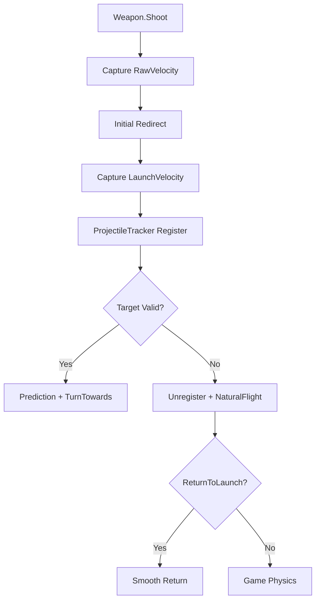

# CompleteCheatMenu 弹丸追踪生命周期与回正实施计划

> **For Claude:** REQUIRED SUB-SKILL: Use superpowers:executing-plans to implement this plan task-by-task.

**Goal:** 修复目标被击杀或销毁后弹丸继续沿最后一次制导方向偏移的问题，并将 Caijue-MagicBullet 的目标生命周期检查、所有权隔离和一次性初始速度记录引入 CompleteCheatMenu，同时保留当前对存活移动目标的连续制导能力。

**Architecture:** 弹丸生成时记录 `RawVelocity`（游戏原始速度）和 `LaunchVelocity`（首次重定向后的出膛速度），并将其与 `Projectile → TargetSolution` 一起注册。飞行期间仅在目标有效时执行现有预测制导；目标死亡、销毁或组件失效后立即注销目标并进入 `NaturalFlight`，可选地在限定时间内平滑回到 `LaunchVelocity`。第一阶段不对同一发弹丸执行中途换锁，下一发重新获取目标。

**Tech Stack:** C#、.NET Standard 2.1、BepInEx 5.4.23.5、Harmony、Unity 6、Unity Physics、PowerShell、Python 确定性回归测试。

---

## 1. 范围与完成定义

### 1.1 纳入范围

- 弹丸初始速度和原始速度的双基准保存。
- `Creature.IsDead`、`Item.IsDestroying`、`Behaviour.isActiveAndEnabled` 生命周期检查。
- 目标失效后的制导状态清理。
- 默认自然飞行模式和可选 `LaunchVelocity` 平滑回正模式。
- FirePoint 旋转快照与 Shoot Finalizer 恢复，消除下一发残留枪口方向。
- 单发、多弹丸、RapidFire、本地所有权和非本地弹丸隔离。
- 中文配置项、诊断日志、构建、汉化、部署和回滚。

### 1.2 不纳入第一阶段

- 同一发弹丸击杀后自动切换到新目标。
- 将弹丸强制回到 `RawVelocity` 的瞬时折返。
- 改变 NPC、Boss 或远端玩家弹丸行为。
- 修改伤害、命中倍率或网络结算逻辑。

### 1.3 默认行为

```text
目标有效       → 继续现有连续制导
目标死亡/销毁  → 立即停止制导并保留当前物理速度
ReturnToLaunch → 仅在配置开启时平滑回到 LaunchVelocity
下一发开火     → 重新获取目标
```

### 1.4 完成标准

1. 存活移动目标的预测、重力补偿和转向速度限制保持现有行为。
2. 目标 `Creature.IsDead` 变为 true 后，下一次弹丸更新不再读取其位置或速度。
3. 目标销毁、组件禁用或 Transform 失效后，`ProjectileTracker` 映射被清理。
4. 默认模式下弹丸沿失效瞬间的速度自然飞行，不出现持续吸向尸体的曲线。
5. 回正模式下速度在 `ReturnDuration` 内有限角速度地接近 `LaunchVelocity`，不产生瞬时折线。
6. FirePoint 在 `Shoot()` Finalizer 后恢复开火前旋转；本发弹丸方向不受恢复动作影响。
7. 多弹丸、RapidFire、本地弹丸过滤和移除队列测试全部通过。
8. 构建 DLL、中文 DLL、差异文件、验证记录和可运行回滚脚本全部生成。
9. 独立副本执行回滚后 SHA-256 恢复到基线；修改版工作副本保持不变。

---

## 2. 目标架构



### 2.1 状态字段

在 `ProjectileGuidance.GuidanceState` 增加：

- `RawVelocity`：AddProjectile 前缀收到的原始速度。
- `LaunchVelocity`：初始重定向完成后的速度。
- `InvalidatedAt`：目标第一次失效的时间戳。
- `Mode`：`Tracking`、`Returning`、`NaturalFlight`。
- `ReturnStartVelocity`：进入回正时的速度快照。

在 `ProjectileSpawnState` 和 `ProjectileTracker` 中传递并保存相同的速度元数据，避免首次 `Step()` 时丢失出膛基准。

### 2.2 目标有效性

`ProjectileTracker.IsValidTarget()` 和 `TryGetTarget()` 统一检查：

- Unity 对象存活且 Transform 非空。
- `Behaviour.isActiveAndEnabled` 为 true（可通过反射兼容游戏版本）。
- `Creature.IsDead` 为 false。
- `Item.IsDestroying` 为 false。
- 弹丸仍是本地玩家所有。

### 2.3 回正策略

- `NaturalFlight`：注销目标，不再写入 `projectile.Velocity`。
- `ReturnToLaunchVelocity = false`：默认使用 `NaturalFlight`。
- `ReturnToLaunchVelocity = true`：使用 `Vector3.RotateTowards`，以 `ReturnTurnSpeed` 和 `ReturnDuration` 限制回正。
- 回正完成后移除 GuidanceState，交还游戏物理。
- 不允许回正逻辑把速度大小变成 0 或 NaN/Infinity。

---

## 3. 分步实施任务

### Task 1: 建立失败用例和基线

**Files:**
- Modify: `D:\Code\How2fish\EnvinciblesMods-CompleteCheatMenu\tests\projectile_guidance_test.py`
- Create: `D:\Code\How2fish\EnvinciblesMods-CompleteCheatMenu\artifacts\projectile-guidance-reset\baseline.txt`

**Steps:**
1. 添加目标死亡、目标销毁、自然飞行、LaunchVelocity 回正、非本地弹丸隔离测试。
2. 先运行测试，记录当前实现对死亡目标仍继续制导的失败结果。
3. 保存当前 DLL SHA-256 和测试命令到 `baseline.txt`。
4. 确认失败只来自目标生命周期/回正语义，不修改生产源码。

**Expected:** 基线测试明确复现“死亡目标仍有效”或“失效后没有回正基准”。

### Task 2: 扩展弹丸注册元数据

**Files:**
- Modify: `D:\Code\How2fish\EnvinciblesMods-CompleteCheatMenu\decompiled-src\CompleteCheatMenu\Targeting\ProjectileSpawnRegistration.cs`
- Modify: `D:\Code\How2fish\EnvinciblesMods-CompleteCheatMenu\decompiled-src\CompleteCheatMenu\Targeting\ProjectileTracker.cs`
- Modify: `D:\Code\How2fish\EnvinciblesMods-CompleteCheatMenu\decompiled-src\CompleteCheatMenu\Patches\WeaponAddProjectile_Patch.cs`

**Steps:**
1. 在 `ProjectileSpawnState` 增加 `RawVelocity` 和 `LaunchVelocity`。
2. 在 AddProjectile/AddProjectiles 前缀中先复制原始速度，再执行初始重定向。
3. 注册新弹丸时将两个速度快照写入 Tracker。
4. 为多弹丸按每个 velocity 保存对应快照。
5. 运行注册元数据测试。

**Expected:** 每个本地弹丸都有稳定的原始速度和实际出膛速度，不影响速度大小。

### Task 3: 引入 Caijue 生命周期检查

**Files:**
- Modify: `D:\Code\How2fish\EnvinciblesMods-CompleteCheatMenu\decompiled-src\CompleteCheatMenu\Targeting\ProjectileTracker.cs`
- Modify: `D:\Code\How2fish\EnvinciblesMods-CompleteCheatMenu\decompiled-src\CompleteCheatMenu\Targeting\TargetSolution.cs`（仅在需要缓存组件引用时）

**Steps:**
1. 增加 `Creature.IsDead` 检查。
2. 增加 `Item.IsDestroying` 检查。
3. 增加 Behaviour/Transform 激活状态检查，并保留反射失败时的兼容分支。
4. 让对象失效时同时移除对象映射和 ID 映射。
5. 运行死亡、销毁、禁用组件和 ID 回退测试。

**Expected:** 目标死亡或销毁后的下一次 `TryGetTarget()` 返回 false，且不会继续读取目标位置。

### Task 4: 改造 Guidance 状态机

**Files:**
- Modify: `D:\Code\How2fish\EnvinciblesMods-CompleteCheatMenu\decompiled-src\CompleteCheatMenu\Targeting\ProjectileGuidance.cs`
- Modify: `D:\Code\How2fish\EnvinciblesMods-CompleteCheatMenu\decompiled-src\CompleteCheatMenu\Runtime\CheatState.cs`
- Modify: 配置绑定和中文标签对应的配置文件/资源

**Steps:**
1. 增加 `Tracking`、`Returning`、`NaturalFlight` 状态。
2. 首次取到 Tracker 元数据时初始化 `RawVelocity`、`LaunchVelocity`。
3. 目标失效时先注销 Tracker，再停止预测和转向。
4. 默认进入 `NaturalFlight`，不再写入速度。
5. 开启 `ReturnToLaunchVelocity` 时，以有限角速度平滑回正。
6. 回正完成或超时后删除状态，避免字典泄漏。
7. 运行 Guidance 状态机测试。

**Expected:** 存活目标仍连续制导；死亡目标不再被追踪；默认不产生额外折线；可选模式平滑回到出膛方向。

### Task 5: 恢复 FirePoint 状态

**Files:**
- Modify: `D:\Code\How2fish\EnvinciblesMods-CompleteCheatMenu\decompiled-src\CompleteCheatMenu\Targeting\MagicShotContext.cs`
- Modify: `D:\Code\How2fish\EnvinciblesMods-CompleteCheatMenu\decompiled-src\CompleteCheatMenu\Patches\WeaponShoot_Patch.cs`

**Steps:**
1. 在 `MagicShotContext.Begin()` 前保存 FirePoint 原始旋转。
2. 允许 `ShotRedirector` 为本发开火设置临时方向。
3. 在 Shoot Finalizer 中恢复 FirePoint 旋转并清理上下文。
4. 验证恢复动作发生在弹丸创建之后。
5. 运行 FirePoint 恢复和下一发方向测试。

**Expected:** 本发弹丸仍使用目标方向；下一发不会继承上一发的 FirePoint 偏转。

### Task 6: 编译、汉化和静态审查

**Files:**
- Modify: `D:\Code\How2fish\EnvinciblesMods-CompleteCheatMenu\decompiled-src\build.ps1`（仅在参数需要时）
- Create: `D:\Code\How2fish\EnvinciblesMods-CompleteCheatMenu\artifacts\projectile-guidance-reset\CompleteCheatMenu.projectile-guidance.dll`
- Create: `D:\Code\How2fish\EnvinciblesMods-CompleteCheatMenu\artifacts\projectile-guidance-reset\CompleteCheatMenu.projectile-guidance.zh-CN.dll`

**Steps:**
1. 使用当前游戏引用执行构建。
2. 执行现有本地化脚本，保护反射标识符不被翻译。
3. 检查程序集元数据、类型集合、占位符和新增配置标签。
4. 运行全部弹道、目标、可见检测、武器恢复和本地化测试。
5. 保存构建与汉化 SHA-256。

**Expected:** 构建退出码为 0，插件可加载，现有回归测试保持通过。

### Task 7: 部署验证和回滚

**Files:**
- Create: `D:\Code\How2fish\EnvinciblesMods-CompleteCheatMenu\artifacts\projectile-guidance-reset\projectile-guidance-reset.patch`
- Create: `D:\Code\How2fish\EnvinciblesMods-CompleteCheatMenu\artifacts\projectile-guidance-reset\VERIFICATION.txt`
- Create: `D:\Code\How2fish\EnvinciblesMods-CompleteCheatMenu\artifacts\projectile-guidance-reset\ROLLBACK.sh`

**Steps:**
1. 游戏退出后备份当前 DLL，记录基线 SHA-256。
2. 复制汉化构建到游戏插件目录并记录部署 SHA-256。
3. 启动游戏，检查 BepInEx 无 Harmony、NullReference 或配置异常。
4. 依次验证：存活目标、击杀后自然飞行、回正开关、RapidFire、多弹丸和下一发换锁。
5. 在独立测试副本运行 `ROLLBACK.sh`，确认恢复基线 SHA-256。
6. 保留修改版 DLL 在 artifacts 中，不删除工作产物。

**Expected:** 游戏日志无新增插件错误；击杀后弹道不再继续追尸；回滚副本恢复基线，部署目录保留修改版。

---

## 4. 审查清单

### 4.1 正确性审查

- [ ] 目标死亡检查发生在位置/速度读取之前。
- [ ] 目标失效后 `ProjectileTracker` 和 Guidance 状态均被清理。
- [ ] 回正模式不会覆盖自然飞行默认路径。
- [ ] `LaunchVelocity` 只记录一次，不会被后续制导覆盖。
- [ ] 多弹丸不会共享错误的速度快照。
- [ ] `ProjectileRemove_Patch` 重复清理是幂等的。

### 4.2 性能审查

- [ ] 生命周期检查不引入每帧反射扫描。
- [ ] `Behaviour`/`Creature` 成员访问使用缓存的 FieldInfo/PropertyInfo。
- [ ] 回正状态不会创建持续增长的临时列表。
- [ ] 追踪状态在命中、销毁、超时和关闭功能时都能退出。

### 4.3 兼容性审查

- [ ] 保留 `ProjectileOwnership.IsLocalProjectile()` 过滤。
- [ ] NPC、Boss、远端玩家弹丸不进入 Tracker。
- [ ] `AimProjectileTrackingTime <= 0` 时不残留状态。
- [ ] 配置缺失时使用 NaturalFlight 默认值。
- [ ] FirePoint 恢复失败不会阻断游戏原始 Shoot 异常传播。

### 4.4 回归审查

- [ ] 当前自瞄目标选择、可见检测、预测和重力补偿测试通过。
- [ ] ESP、UI、本地化和武器原值恢复测试通过。
- [ ] BepInEx 启动日志中的补丁数量与基线一致或有记录说明。
- [ ] 独立副本回滚测试通过。

---

## 5. 风险与回退点

| 风险 | 观察信号 | 回退点 |
|---|---|---|
| 游戏版本没有 `Creature.IsDead` 绑定 | 日志出现成员绑定失败 | 使用缓存反射并回退到 `Refs.IsAlive` |
| FirePoint 恢复时机过早 | 本发弹丸方向错误 | 仅恢复旋转，不改已注册弹丸速度 |
| 返回速度产生突变 | 速度角度在单帧变化过大 | 关闭 `ReturnToLaunchVelocity`，使用 NaturalFlight |
| 多弹丸 ID 冲突 | Tracker 映射数量异常 | 以对象引用为主，ID 仅作回退 |
| 关闭自瞄后残留状态 | ActiveCount 持续增长 | 复用 `ProjectileGuidance.Clear()` 和移除队列清理 |

---

## 6. 审查结论

**审查结果：通过，允许进入 Task 1。**

已确认方案与 Caijue-MagicBullet 的关键优点一致：目标死亡立即失效、严格本地弹丸所有权隔离、初始速度一次性记录、默认自然飞行。方案同时保留 CompleteCheatMenu 对存活移动目标的连续制导，因此不会用“一次性重定向”完全替换当前功能。第一阶段默认不换锁、不强制回到 RawVelocity，避免产生突兀折返和目标跳转。

**执行顺序：** Task 1 → Task 2 → Task 3 → Task 4 → Task 5 → Task 6 → Task 7。
